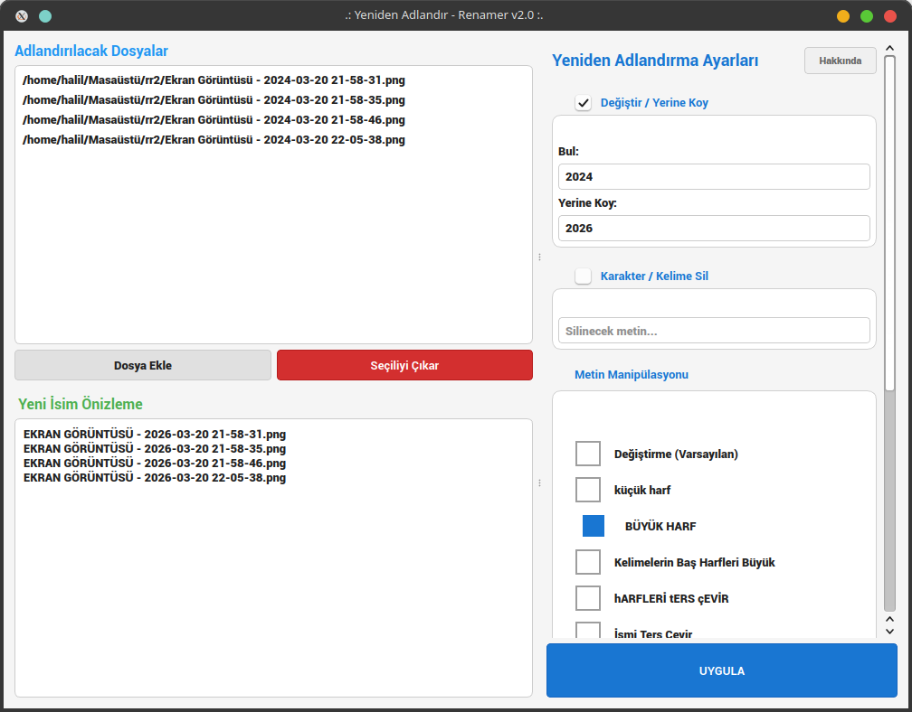
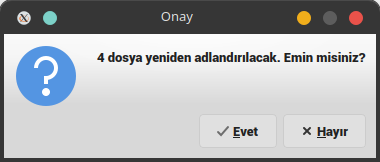
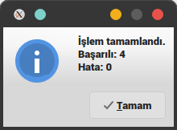

# Yeniden Adlandırıcı  ( Renamer )

Dosya isimlerini, belirlediğiniz parametrelere göre yeniden adlandıran uygulama.

## Yeniden Adlandırma Yapılırken Kullanılabilecek Özellikler

* Dosya adını sıralı artırma
* Dosya adına ön ek ekleme
* Dosya adına son ek ekleme
* Dosya adını büyük harflere çevirme
* Dosya adını küçük harflere çevirme
* Dosya adındaki belirlenen karakterleri (ör. "boşluk") silme
* Dosya adındaki belirlenen kelimeleri silme
* Dosya adındaki karakter(ler)i başka karakter(ler) ile değiştirme

## Uygulama Arabirimi;

