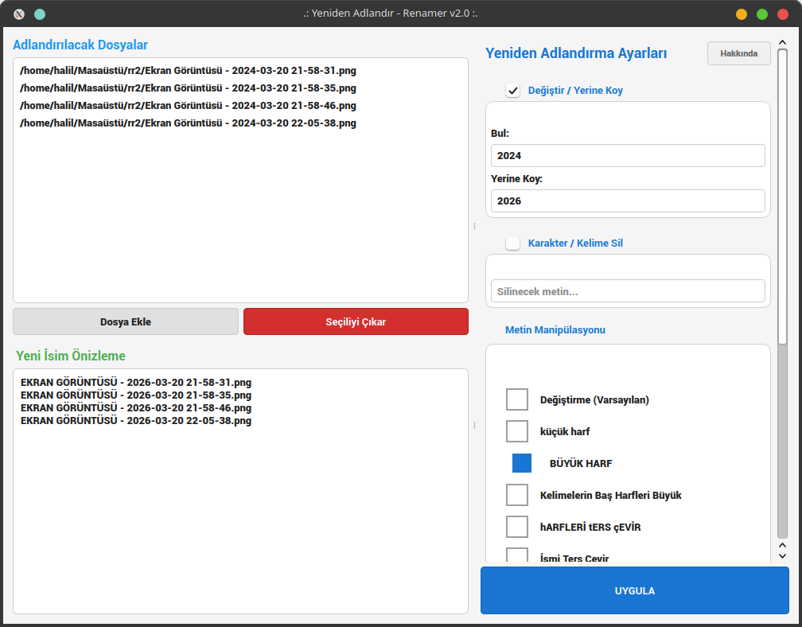
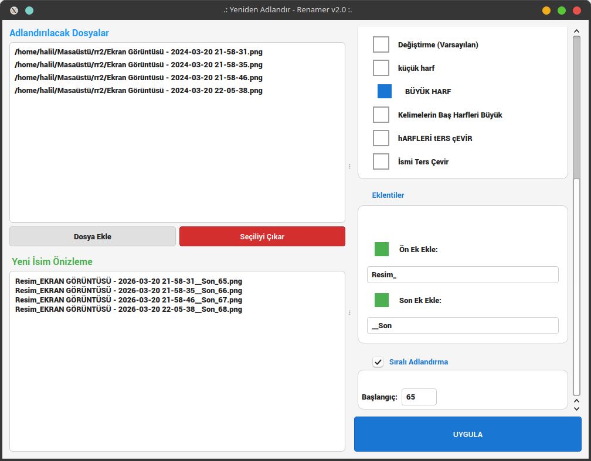
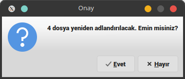
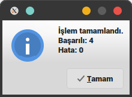
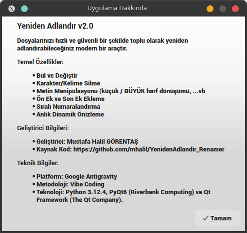

# Yeniden Adlandırıcı  ( Renamer )

Dosya isimlerini, belirlediğiniz parametrelere göre yeniden adlandıran uygulama.

Yaptığınız değişiklikleri, Önizleme ekranında eşzamanlı olarak görebilirsiniz.

## Yeniden Adlandırma Yapılırken Kullanılabilecek Özellikler

* Dosya adında adındaki karakter(ler)i başka karakter(ler) ile değiştir

* Dosya adındaki belirlenen karakter / kelime (Ör. "boşluk") sil

* Dosya adını BÜYÜK HARFE çevir

* Dosya adını küçük harflere çevir

* Dosya adındaki her kelimenin baş harfini büyük harfe çevir

* Dosya Adındaki büyük/küçük harfleri ters çevir (Ör. Halil.docx > hALİL.docx )

* Dosya adındaki harf sıralamasını ters çevir (Ör.  Mustafa.pdf > afatsuM.pdf) 

* Dosya adına ön ek ekleme

* Dosya adına son ek ekleme

* Dosya adına sıralı sayı ekle; Başlangıç sayısını belirle

## Geliştirici Bilgileri:

**Geliştirici**: Mustafa Halil GÖRENTAŞ

**Kaynak Kod**: https://github.com/mhalil/YenidenAdlandir_Renamer

## Teknik Bilgiler:

**Platform**: [Google Antigravity](https://antigravity.google/)
**Metodoloji**: Vibe Coding
**Teknoloji**: [Python](https://www.python.org/) 3.12.4, [PyQt6]((https://www.riverbankcomputing.com/static/Docs/PyQt6/)) [Riverbank Computing](https://riverbankcomputing.com/software/pyqt) ve [Qt Framework (The Qt Company)](https://www.qt.io/development/qt-framework).

## Uygulama Arabirimi;

